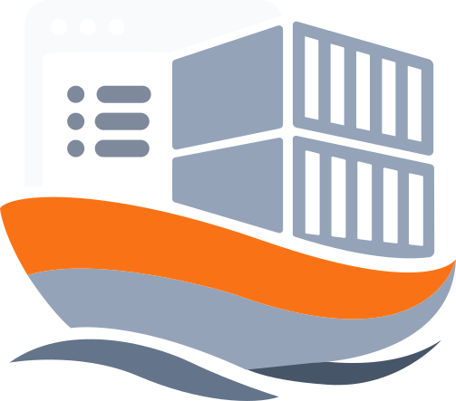

<br>
<br>
<div align="center">

<br>
<br>
<h1>
<code style="color: #ff7300">DockLiner</code></h1>
</div>
<br>
<br>

A lightweight, self-hosted deployment manager for personal Docker-based projects. DockLiner manages projects from GitHub, local folders, or downloaded archives, and deploys them with Docker Compose or a plain Dockerfile. It runs natively on the host beside aaPanel.

## Core Goals

- **One-click deployments** — Quick Deploy, Build, and Run actions per project.
- **Multiple source types** — GitHub repos, local directories, or downloaded archives.
- **No leftover cache** — Source is mirrored directly into the project deploy path; no `github-cache` or intermediate clone directories.
- **Clear Docker errors** — Actionable messages when Docker is missing, not running, or using the wrong engine context.
- **SQLite-backed state** — Lightweight, no external database.
- **PWA-ready** — Works as an installable web app with a responsive UI.
- **aaPanel friendly** — Runs on a custom port and sits behind an Nginx reverse proxy.

## Technology Stack

| Component | Technology |
|---|---|
| Backend | Python 3.11+ / FastAPI |
| ASGI Server | Uvicorn (with auto-reload in dev) |
| Database | SQLite (SQLAlchemy + Alembic) |
| Docker Control | Docker CLI via subprocess |
| Frontend | Jinja2 templates + vanilla JS |
| Auth | Cookie-based session |
| Environment | `.env` + python-dotenv |

## Directory Structure

```
/data/
├── dockliner/                  # Application code
│   ├── main.py
│   ├── app/
│   │   ├── core/               # Config, database, security
│   │   ├── models/             # SQLAlchemy models
│   │   ├── routers/            # API + page routes
│   │   ├── services/           # Git, Docker, deploy, file scanning
│   │   ├── templates/          # Jinja2 HTML templates
│   │   └── static/             # CSS, JS, logo
│   ├── alembic/                # Database migrations
│   ├── downloads/              # Imported archive sources
│   ├── projects/               # Live project deploy directories
│   ├── .env
│   ├── requirements.txt
│   └── gunicorn.conf.py
├── dockliner.db                # SQLite database
└── logs/                       # Application logs
```

## Data Model

### Projects Table

| Field | Description |
|---|---|
| `id` | Primary key |
| `name` | Unique project name |
| `source_type` | `github`, `download`, or `local` |
| `source_url` / `source_path` | Origin reference |
| `deploy_path` | Destination directory (`/data/projects/{name}`) |
| `compose_file` | Detected or chosen compose file |
| `dockerfile` | Detected or chosen Dockerfile |
| `env_file` | Detected or chosen `.env` file |
| `port` | Primary project port |
| `status` | Current status (`running` / `stopped` / `error`) |
| `last_deployed` | Last deployment timestamp |
| `env_vars` | Environment variables (JSON) |

## Deployment Flow

1. User creates a project from GitHub, a local directory, or a downloaded archive.
2. Source is copied/mirrored into `deploy_path`.
3. User edits compose, Dockerfile, and `.env` on the Project Setup page; detected files are auto-selected.
4. Project Detail page provides **Quick Deploy**, **Build**, **Run**, **Start**, **Restart**, **Stop**, and **Logs**.
5. Deploy runs `docker compose build` then `docker compose up -d` (or direct `docker build` / `docker run` when no compose is present).

## UI Layout

- **Dashboard** — Project list, Docker engine status, running containers, images, networks, and volumes.
- **Projects** — All projects with status and delete action.
- **Project Detail** — VSCode-like file viewer, multi-step deploy controls, live logs.
- **Project Setup** — Compose / Dockerfile / `.env` detection with auto-selection.
- **Downloads** — Manage imported archives.
- **Settings** — Single-page theme, access tokens, and system info. No sub-pages.
- **Custom modals** — All confirmation/error/info dialogs use the in-app modal system; native `alert` / `confirm` are gone.

## Security

- Runs as a non-root user in the `docker` group.
- GitHub PAT is stored as an access token and used only for repo cloning.
- Docker socket access is limited to the `docker` group.
- No secrets rendered in the UI.

## aaPanel Integration

- aaPanel handles sites, domains, and SSL.
- DockLiner runs on a separate port (default `8080`).
- Point an aaPanel reverse-proxy site to `http://127.0.0.1:8080`.

## Development Quick Start

1. Clone the repository to `/data/dockliner/`.
2. Copy `.env.example` to `.env` and set `SECRET_KEY`.
3. Install dependencies: `pip install -r requirements.txt`.
4. Run: `python main.py`.
5. Open `http://localhost:8080` and log in.

## Status

- **Dashboard** redesign proposal pending approval (`doc/0004.md`).
- **Docker error diagnosis** and daemon status caching implemented.
- **Settings** flattened to a single page.
- **Last Updated**: July 2026
